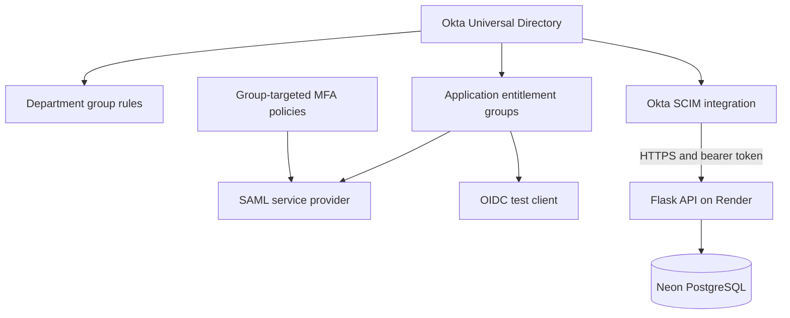
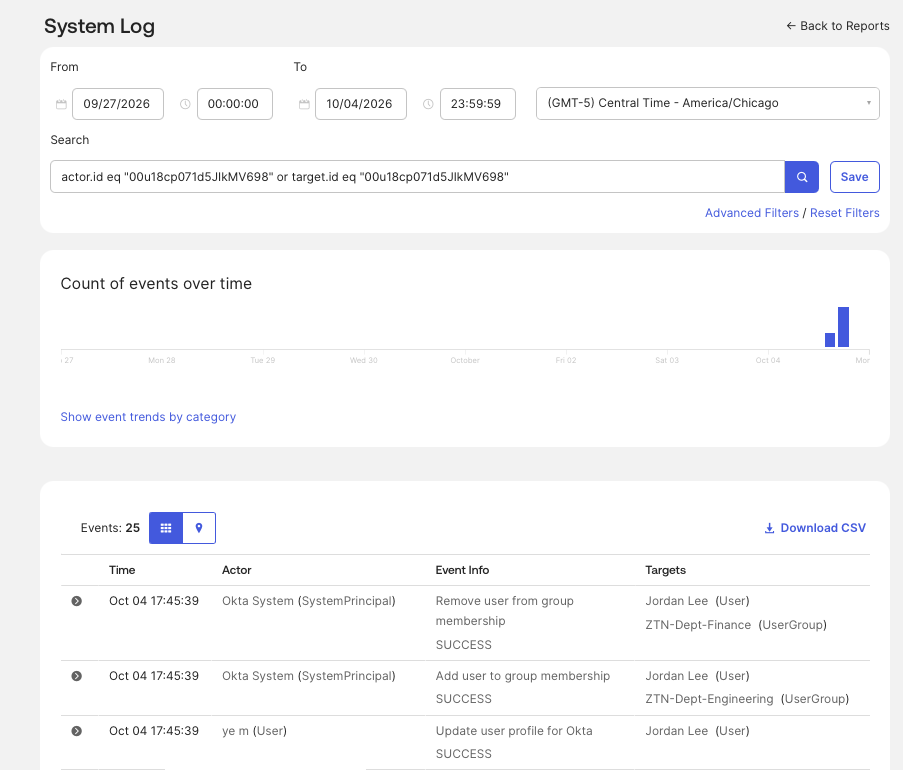
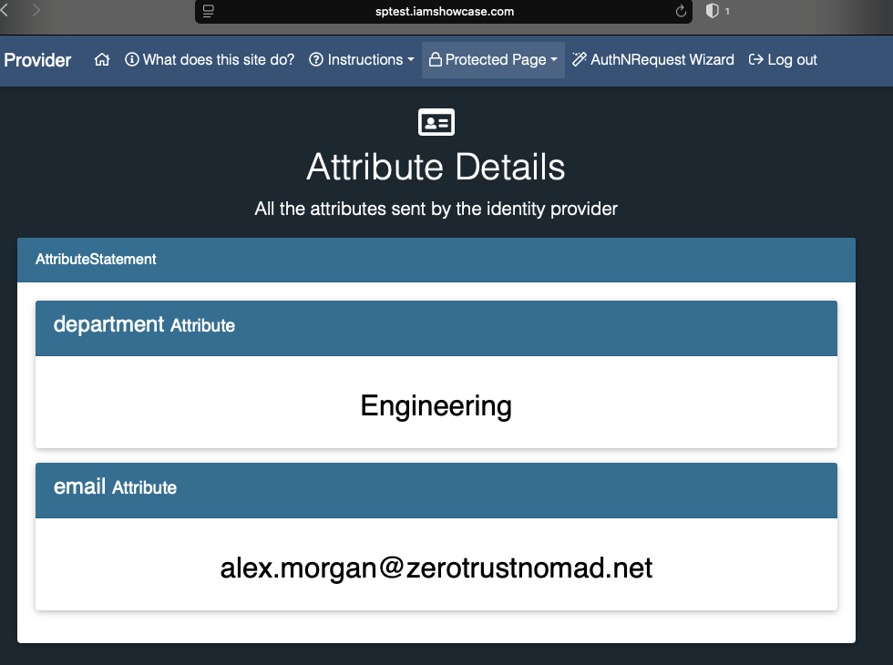
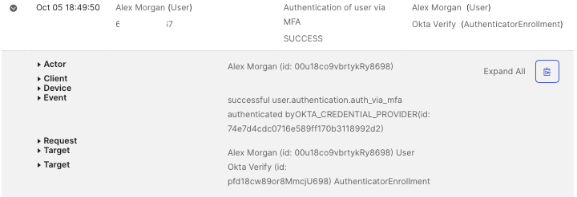
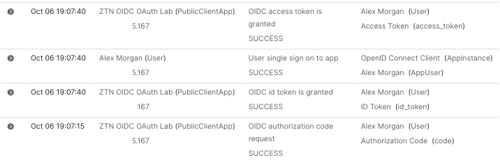
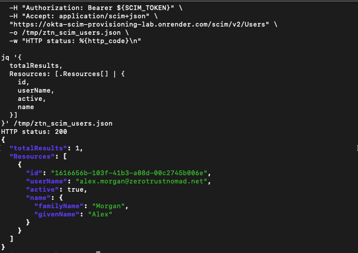

# ZeroTrustNomad — Cloud Identity & Access Engineering Lab

**Okta · Group automation · SAML 2.0 · MFA / FastPass · OIDC · SCIM 2.0 · Flask · Render · Neon PostgreSQL**

## Overview

This cloud-only lab demonstrates how identity profiles, group membership, application assignments, authentication policies, and downstream provisioning work together. It combines successful and denied access tests with Okta System Log evidence and destination-side results.

The SCIM portion connects Okta to a custom Flask API hosted on Render, with user records stored in Neon PostgreSQL. The wider lab also demonstrates department-based group reassignment, SAML federation, group-targeted MFA, and an OIDC authorization-code flow.

**Current scope:** SCIM authentication and Joiner provisioning are verified. The Okta-only Finance → Engineering group move is verified. Downstream SCIM department synchronization remains unverified, and Leaver testing is incomplete. This is a learning project, not a production-certified identity service.

## Results at a glance

| Scenario | Result | Evidence |
| --- | --- | --- |
| Department-based group membership | Verified in Okta | 04–08 |
| Finance → Engineering group move | Verified in Okta | 06–08 |
| SAML assignment-based access | Unassigned denial and assigned access verified | 10–12, 19–21 |
| SAML department/email claims | Received by service provider | 21 |
| Group-targeted MFA | Challenge and successful MFA authentication verified | 23–30 |
| OIDC application entitlement | Unassigned denial and assignment documented | 33, 35–36 |
| OIDC authorization-code flow | Successful code request and token issuance logged | 38 |
| OIDC department claim | Engineering inspected in decoded ID token | 32, 37 |
| SCIM bearer authentication | Unauthorized rejection and authorized HTTP 200 verified | 40, 42–43 |
| SCIM Joiner | Okta creation events and active target user verified | 45–46 |
| SCIM department Mover | Unverified end to end | 47 is an Okta event only |
| SCIM Leaver | Testing incomplete | 44 shows configuration only |

## Architecture

Department groups and application entitlement groups are separate controls. A department change demonstrably changed department membership; the evidence does not establish automatic SAML or OIDC entitlement changes during that move. SAML/OIDC authentication flows are separate from SCIM account provisioning.

## Technology and responsibilities

| Component | Role |
| --- | --- |
| Okta Universal Directory | Identity profiles, department attributes, and group membership |
| Okta group rules | Department-based membership automation |
| Okta application integrations | SAML federation, OIDC authentication, and SCIM provisioning |
| Okta Verify / FastPass | User verification and MFA authentication |
| Okta System Log | Policy evaluations, access decisions, and provisioning events |
| IAMShowcase SAML test service provider | Federation result and received assertion attributes |
| OIDC test tooling and local claim inspection | Authorization flow testing and decoded token inspection |
| Python / Flask / Gunicorn | SCIM HTTP service and application server |
| Render | Hosted web service and deployment logs |
| Neon PostgreSQL / psycopg | Persistent identity records and database access |
| GitHub | Source control and portfolio evidence |

No Active Directory, domain controller, or local VM is required for this cloud-only project.

## 1. Department groups and the Okta Mover

Created distinct department, application-entitlement, and MFA-policy groups. Configured department rules and confirmed rule-managed membership. Jordan initially belonged to Finance; after the profile change, Jordan belonged to Engineering, and System Log recorded successful Finance removal and Engineering addition.

This verifies a Mover operation inside Okta. It does not verify the same attribute changed in the downstream SCIM application.

*Okta audit evidence: profile update, Finance removal, and Engineering addition.*

## 2. SAML federation and application access

Configured a SAML application with a service-provider ACS URL and audience. Mapped department and email attributes, assigned the application to an entitlement group, and captured a denied access attempt for an unassigned user. After assignment, the service provider displayed successful federation and the expected identity attributes.

Assertion issuer, audience, timestamps, and hashing details were inspected. Independent cryptographic signature-validation testing is not claimed.

*The SAML service provider received Engineering and email attributes.*

## 3. Group-targeted MFA

Configured an enrollment policy requiring Password and Okta Verify for a dedicated group. Attached a group-targeted authentication policy to the SAML application and captured an Okta Verify user-verification prompt, successful federation, a named-rule CHALLENGE event, and successful MFA authentication.

The evidence demonstrates the tested user and application path. It does not establish tenant-wide enforcement or universal phishing resistance across all devices and factors.

*Okta System Log records successful MFA authentication.*

## 4. OIDC authorization-code flow

Configured client-secret authentication, the Authorization Code grant, allowed redirect URIs, a department claim expression, and group-based application assignment. An unassigned user was denied. Following assignment, System Log recorded successful authorization-code and token issuance events. Decoding the ID-token payload showed the expected Engineering department.

The shown decoding script inspects claims; it does not validate the JWT signature, issuer, audience, nonce, or expiry. PKCE is not shown as required in the client configuration. Redirect-URI configuration alone does not prove every listed callback was exercised.

*Successful OIDC authorization-code request and token issuance audit trail.*

## 5. SCIM authentication and Joiner provisioning

Deployed the Flask service to Render. An unauthorized request returned a SCIM-formatted 401 error. An authenticated Users request returned HTTP 200 and an empty ListResponse, and Okta successfully verified its API credentials.

Enabled Create Users, Update User Attributes, and Deactivate Users. Assigning Alex to the integration produced successful Okta account-creation events. A subsequent authenticated Users request returned Alex with a resource ID, name, username, and active: true.

The destination response, together with Okta creation events, supports the Joiner outcome. Repository code stores user attributes in the PostgreSQL scim_users table; screenshot 46 is an API response rather than a direct PostgreSQL query or persistence-across-restart test.

*Authenticated destination API retrieval confirms Alex exists with active: true.*

## Implemented SCIM API

Base path: `/scim/v2`. The following handlers exist in the reviewed repository code. Implementation is distinguished from end-to-end testing.

| Method | Path | Purpose | Evidence status |
| --- | --- | --- | --- |
| GET | /ServiceProviderConfig | Advertise capabilities | Response captured |
| GET | /Users | List users; selected equality filters and pagination | Unfiltered listing verified; filters/pagination not demonstrated |
| POST | /Users | Create user | Joiner verified through Okta logs and retrieval |
| GET | /Users/{id} | Retrieve individual user | Implemented; separate test not supplied |
| PUT | /Users/{id} | Replace user | Implemented; downstream Mover unverified |
| PATCH | /Users/{id} | Supported attribute updates | Implemented; downstream Mover and Leaver unverified |

Code supports core attributes, active, and selected Enterprise User extension attributes. Filtering is limited to userName or externalId equality. The service does not implement SCIM Groups, bulk requests, sorting, ETags, or password changes. It uses a static lab bearer token rather than an OAuth token-issuance service.

## Limitations and unresolved validation

- **Downstream Mover:** Screenshot 47 records successful profile push in Okta, but does not display the updated destination department. Prior investigation reported a null department and no corresponding recent PUT/PATCH request. Those observations are retained as investigation notes, not presented as screenshot-verified results in this package.
- **Leaver:** Deactivate Users is enabled, but a complete unassignment/deactivation test and destination active: false result are not supplied.
- **Token/assertion inspection:** Payload and assertion details were inspected; independent security validation tests are not evidenced.
- **Lab scope:** No load testing, availability measurement, compliance certification, enterprise rollout, or production-readiness claim is made.
- **Hosting:** The captured Render deployment warns that the free instance may spin down with inactivity; successful deployment does not imply continuous availability.

Temporary diagnostic logging was removed from app.py in commit [e3cb0eb](https://github.com/ZeroTrustNomad/Okta-SCIM-Provisioning-Lab/commit/e3cb0eb), as recorded in the lab handoff. This documentation work does not restart the unresolved provisioning investigation.

## Security and configuration

The reviewed API reads DATABASE_URL and SCIM_BEARER_TOKEN from environment variables. SCIM routes require bearer authentication, token comparison uses hmac.compare_digest, and database statements use parameterized values. These are implementation observations, not a comprehensive security assessment.

The supplied credential screenshots keep bearer tokens and client secrets masked; terminal requests reference an environment variable instead of printing the token. Screenshot pixels in this package are unchanged. Test-user email addresses, the lab tenant hostname, audit identifiers, and some workstation details remain visible. See [publication notes](docs/PUBLICATION-NOTES.md) before publishing.

## Evidence navigation

All **47 screenshots** are organized into five folders and individually captioned in the [evidence index](docs/EVIDENCE-INDEX.md).

| Folder | Screenshots | Subject |
| --- | --- | --- |
| screenshots/01-groups | 01–08 | Groups and Okta Mover |
| screenshots/02-saml | 09–22 | SAML configuration, MFA baseline, federation, and claims |
| screenshots/03-mfa | 23–30 | Group-targeted MFA |
| screenshots/04-oidc | 31–38 | OIDC assignment, authorization, and claims |
| screenshots/05-scim | 39–47 | Deployment, authentication, and Joiner |

## Engineering lessons

1. Correlate identity-provider events with destination state before declaring provisioning successful.
2. Separate department membership, application entitlements, and authentication policy targeting.
3. Test denied access alongside successful access to demonstrate assignment boundaries.
4. Distinguish receiving a claim from independently validating the security of its token or assertion.
5. Document implemented functionality separately from tested lifecycle outcomes.

## Portfolio summary

Built a cloud-only Okta IAM lab demonstrating department-based group automation, assignment-controlled SAML and OIDC access, group-targeted MFA, and SCIM Joiner provisioning to a Flask service backed by PostgreSQL. Validated outcomes through Okta audit events, service-provider claims, and authenticated destination API responses; documented unverified department synchronization and incomplete deactivation testing.

[ZeroTrustNomad on GitHub](https://github.com/ZeroTrustNomad)
