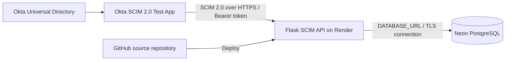

# Okta SCIM 2.0 Provisioning Lab

**Cloud-only identity lifecycle provisioning | Okta Universal Directory · SCIM 2.0 · Python/Flask · Render · Neon PostgreSQL**

## Project overview

This hands-on IAM lab connects an Okta application integration to a custom, cloud-hosted SCIM 2.0 service. The service authenticates API requests using a bearer token, implements SCIM user endpoints, and persists identity records in PostgreSQL.

The project focuses on downstream identity provisioning, the mechanics of the SCIM protocol, troubleshooting attribute mappings, and evidence-based validation of identity lifecycle operations.

> **Project status:** Joiner (user creation) and authenticated user retrieval were verified in the lab. The department-change Mover workflow was investigated but **not validated end-to-end**. Leaver (deactivation) remains **untested**. The API contains update/deactivation handling, but implemented code is not the same as a verified Okta-to-database workflow.

## Architecture



**Infrastructure:** The lab is cloud-only. It does not require Active Directory, an on-premises domain controller, or local virtual machines.

## Technology stack

| Component | Role |
| --- | --- |
| Okta Universal Directory | Source identity profiles and application assignments |
| Okta SCIM 2.0 Test App (OAuth Bearer Token) | SCIM client / outbound provisioning integration |
| Python + Flask | Custom SCIM 2.0 API |
| Gunicorn | Application server |
| Render | Hosted HTTPS web service and deployment |
| Neon PostgreSQL | Persistent SCIM user records |
| psycopg | PostgreSQL client |
| GitHub | Source control and project documentation |

## Implemented API

Base path: `/scim/v2`

| Method | Endpoint | Purpose |
| --- | --- | --- |
| GET | `/ServiceProviderConfig` | Advertise supported service-provider capabilities |
| GET | `/Users` | List users; supports selected filters and pagination |
| POST | `/Users` | Create a user |
| GET | `/Users/{id}` | Retrieve a user |
| PUT | `/Users/{id}` | Replace a user |
| PATCH | `/Users/{id}` | Apply supported user attribute changes |

**Implemented attribute support:** Core user fields, including `active`, and selected SCIM Enterprise User extension attributes, including `department`, `division`, `organization`, `costCenter`, `employeeNumber`, and `manager`.

**Scope limitations:** This is a learning implementation, not a production-certified SCIM server. The application does not implement SCIM Groups or every SCIM schema/operation. Authentication uses a static lab bearer token, not a full OAuth authorization server.

## What was verified

### 1. Cloud deployment and authentication

- Deployed the Flask API on Render from this GitHub repository.
- Connected the service to a Neon PostgreSQL database.
- Configured bearer-token authentication using the `SCIM_BEARER_TOKEN` environment variable.
- Verified an authenticated request to `GET /scim/v2/Users` returned HTTP **200**.
- Verified Okta's **Test API Credentials** check succeeded.

### 2. Joiner — SCIM user provisioning

- Assigned a test identity (Alex Morgan) to the Okta SCIM application.
- Observed successful Okta provisioning activity.
- Queried the SCIM API and verified the user existed in persistent storage with `active: true`.

**Result:** Joiner scenario verified.

### 3. Mover — department change investigation

- Configured Okta Department mapping to the SCIM Enterprise User extension.
- Verified that the mapping preview resolved the test user's department to **Finance**.
- Verified that the provisioning attribute mapping was configured for **Create and update**.
- Verified that the downstream SCIM user record still returned `department: null`.
- Did not observe a corresponding recent outbound `PUT` or `PATCH` request in Render logs during the investigation.

**Result:** Not verified end-to-end. A successful Okta profile-push event alone does not demonstrate that the downstream PostgreSQL record changed.

### 4. Leaver — deactivation

The API contains user-update handling for the `active` attribute, but the Okta unassignment/deactivation workflow has **not** been validated.

**Result:** Not tested.

## Security practices

- Bearer-token authentication is enforced on `/scim/v2` routes.
- The token and PostgreSQL connection string are supplied via deployment environment variables, not committed to GitHub.
- Token comparison uses `hmac.compare_digest`.
- Temporary request-attribute diagnostic logging used during troubleshooting was removed.
- Screenshots and examples should redact bearer tokens, database credentials, session cookies, personal email addresses where appropriate, and public IP addresses.

> **Important:** Do not paste a live bearer token or `DATABASE_URL` into the README, issue comments, screenshots, or Git commits. If a secret is exposed, rotate it.

## Evidence and screenshots

Screenshots will be organized and added after review. Only validated results will be captioned as successful.

| Evidence area | What the screenshot should demonstrate |
| --- | --- |
| Architecture | Okta → SCIM API → PostgreSQL data flow |
| Render deployment | Service deployed and healthy |
| Authentication | Unauthorized request rejected; authorized request returns HTTP 200 |
| Service provider config | SCIM capability response |
| User listing | Initially empty list and later provisioned user |
| Okta integration | Provisioning configuration and successful credential test |
| Joiner | Okta assignment/provisioning event and persisted active user |
| Mover troubleshooting | Attribute mapping and downstream `department: null` (documented limitation) |

**Screenshots are pending upload and review.** No evidence image links are included until the files are actually committed to the repository.

## Suggested evidence folder structure

```text
screenshots/
  01-infrastructure/
  02-authentication/
  03-okta-integration/
  04-joiner/
  05-mover-investigation/
diagrams/
```

## Lessons learned

1. A successful identity-provider event is not sufficient proof of downstream state: validate the target system directly.
2. SCIM Enterprise User extension attributes require consistent schema names and mapping behavior.
3. Separate authentication, API behavior, provisioning triggers, and persistence when troubleshooting.
4. Distinguish implemented features from end-to-end validated lifecycle outcomes.

## Next steps

- Review and sanitize screenshots, then add evidence with captions and links.
- Optionally revisit Okta's outbound update trigger and validate the Mover workflow.
- Optionally test unassignment/deactivation and confirm `active: false` downstream.
- Add a polished architecture diagram and final evidence index.

---

**Portfolio:** [ZeroTrustNomad on GitHub](https://github.com/ZeroTrustNomad)
